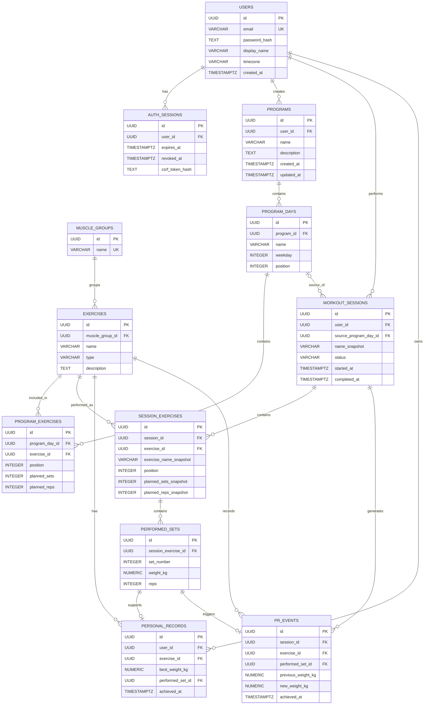

# Diagrama ERD – Pushr

Diagrama prezintă structura bazei de date Pushr, entitățile principale, atributele acestora și relațiile dintre ele.

```mermaid
erDiagram

    USERS {
        UUID id PK
        VARCHAR email UK
        TEXT password_hash
        VARCHAR display_name
        VARCHAR timezone
        TIMESTAMPTZ created_at
    }

    AUTH_SESSIONS {
        UUID id PK
        UUID user_id FK
        TIMESTAMPTZ expires_at
        TIMESTAMPTZ revoked_at
        TEXT csrf_token_hash
    }

    MUSCLE_GROUPS {
        UUID id PK
        VARCHAR name UK
    }

    EXERCISES {
        UUID id PK
        UUID muscle_group_id FK
        VARCHAR name
        VARCHAR type
        TEXT description
    }

    PROGRAMS {
        UUID id PK
        UUID user_id FK
        VARCHAR name
        TEXT description
        TIMESTAMPTZ created_at
        TIMESTAMPTZ updated_at
    }

    PROGRAM_DAYS {
        UUID id PK
        UUID program_id FK
        VARCHAR name
        INTEGER weekday
        INTEGER position
    }

    PROGRAM_EXERCISES {
        UUID id PK
        UUID program_day_id FK
        UUID exercise_id FK
        INTEGER position
        INTEGER planned_sets
        INTEGER planned_reps
    }

    WORKOUT_SESSIONS {
        UUID id PK
        UUID user_id FK
        UUID source_program_day_id FK
        VARCHAR name_snapshot
        VARCHAR status
        TIMESTAMPTZ started_at
        TIMESTAMPTZ completed_at
    }

    SESSION_EXERCISES {
        UUID id PK
        UUID session_id FK
        UUID exercise_id FK
        VARCHAR exercise_name_snapshot
        INTEGER position
        INTEGER planned_sets_snapshot
        INTEGER planned_reps_snapshot
    }

    PERFORMED_SETS {
        UUID id PK
        UUID session_exercise_id FK
        INTEGER set_number
        NUMERIC weight_kg
        INTEGER reps
    }

    PERSONAL_RECORDS {
        UUID id PK
        UUID user_id FK
        UUID exercise_id FK
        NUMERIC best_weight_kg
        UUID performed_set_id FK
        TIMESTAMPTZ achieved_at
    }

    PR_EVENTS {
        UUID id PK
        UUID session_id FK
        UUID exercise_id FK
        UUID performed_set_id FK
        NUMERIC previous_weight_kg
        NUMERIC new_weight_kg
        TIMESTAMPTZ achieved_at
    }

    USERS ||--o{ AUTH_SESSIONS : has
    USERS ||--o{ PROGRAMS : creates
    USERS ||--o{ WORKOUT_SESSIONS : performs
    USERS ||--o{ PERSONAL_RECORDS : owns

    MUSCLE_GROUPS ||--o{ EXERCISES : groups

    PROGRAMS ||--o{ PROGRAM_DAYS : contains
    PROGRAM_DAYS ||--o{ PROGRAM_EXERCISES : contains
    EXERCISES ||--o{ PROGRAM_EXERCISES : included_in

    PROGRAM_DAYS o|--o{ WORKOUT_SESSIONS : source_of

    WORKOUT_SESSIONS ||--o{ SESSION_EXERCISES : contains
    EXERCISES ||--o{ SESSION_EXERCISES : performed_as

    SESSION_EXERCISES ||--o{ PERFORMED_SETS : contains

    EXERCISES ||--o{ PERSONAL_RECORDS : has
    PERFORMED_SETS ||--o| PERSONAL_RECORDS : supports

    WORKOUT_SESSIONS ||--o{ PR_EVENTS : generates
    EXERCISES ||--o{ PR_EVENTS : records
    PERFORMED_SETS ||--o| PR_EVENTS : triggers
```
